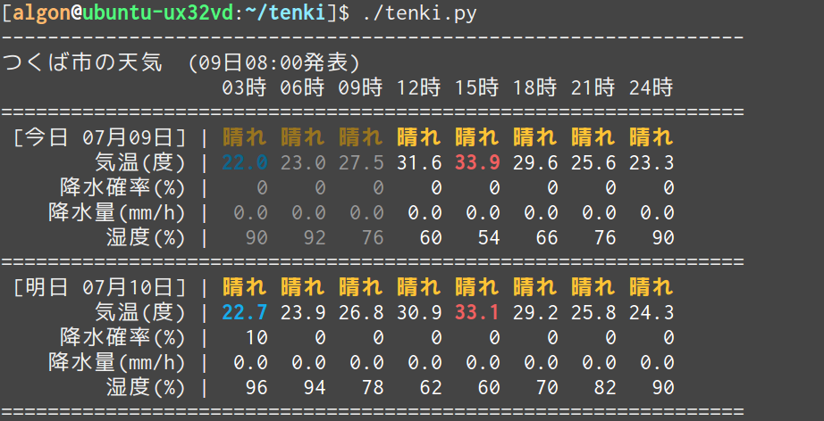

# tenki

## Description
tenki.jpから天気を取得してターミナルに表示します。

## Demo
<br>
ターミナル上での表示

<br>
ターミナル上での表示(URLを指定して札幌市の天気を表示)

<br>
conkyでの表示

## Requirements
- python 2
- [click](http://click.pocoo.org)
- [lxml](http://lxml.de)

## Installation
click, lxmlがインストールされていない場合はインストールしてください。
```
$ sudo pip install click
$ sudo pip install lxml
```

## Usage
```
$ ./tenki.py [opsions...]
```
urlを指定しない場合はつくば市の天気が表示されます。

`--url=[URL]`でtenki.jpの任意の地点の3時間天気のページのURLを指定することで、その地点の天気を表示できます。
```
$ ./tenki.py --url https://tenki.jp/forecast/3/16/4410/13101/3hours.html  # 東京都千代田区の天気を表示
```

`--days=[day]`で表示する日数を指定出来ます。1なら今日の天気のみ、2なら今日・明日の天気、3なら今日・明日・明後日の天気を表示します。
```
$ ./tenki.py --days 3  # 今日・明日・明後日の天気を表示
```


---

`--conky`オプションを付けると、出力がconky用になります。
conkyで使う場合は.conkyrcに以下を追記します。
```
${execp [tenki.pyのパス] --conky}
```


## Licence
- MIT


## Auther
[algon-320](https://github.com/algon-320)
